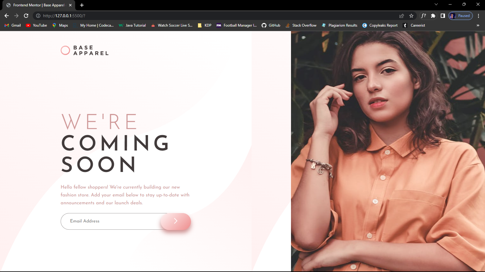
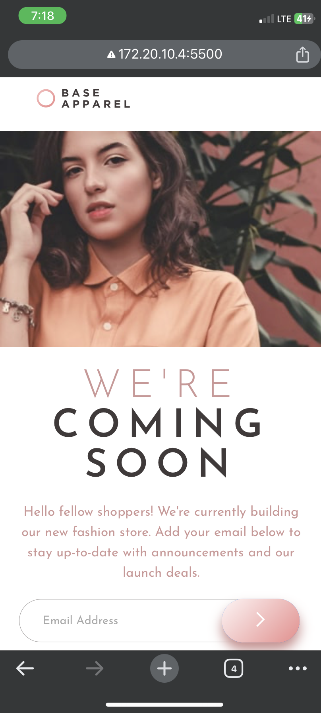
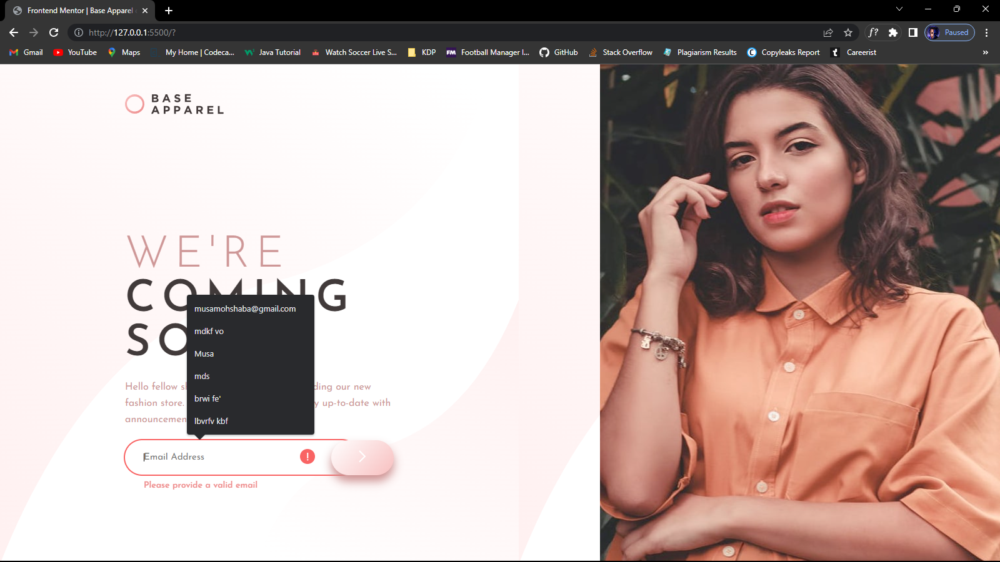

# Frontend Mentor - Base Apparel coming soon page solution

This is a solution to the [Base Apparel coming soon page challenge on Frontend Mentor](https://www.frontendmentor.io/challenges/base-apparel-coming-soon-page-5d46b47f8db8a7063f9331a0). Frontend Mentor challenges help you improve your coding skills by building realistic projects.

## Table of contents

- [Screenshot](#screenshot)
- [Links](#links)
- [My process](#my-process)

  - [Built with](#built-with)

- [Author](#author)

### Screenshot

### Links

- Solution URL: [Solution URl](https://github.com/walidshaba/Base-Apparel-coming-soon-page.git)
- Live Site URL: [Live URL] (https://your-live-site-url.com)

## My process

### Built with

- Semantic HTML5 markup
- CSS custom properties
- Flexbox
- CSS Grid
- Desktop-first workflow

## Author

- Website - [Musa Shaba](https://musashaba-1490d.web.app/)
- Frontend Mentor - [@walidshaba](https://www.frontendmentor.io/profile/walidshaba)
- Twitter - [@codewithmshaba](https://www.twitter.com/codewithmshaba)
